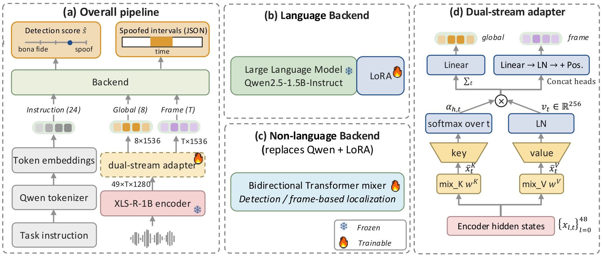
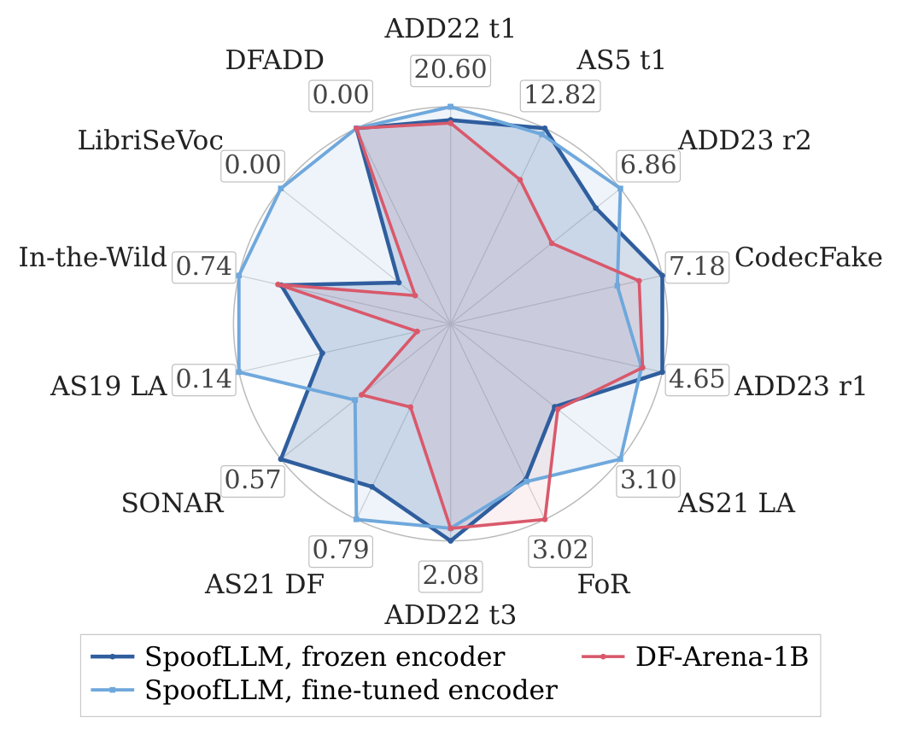
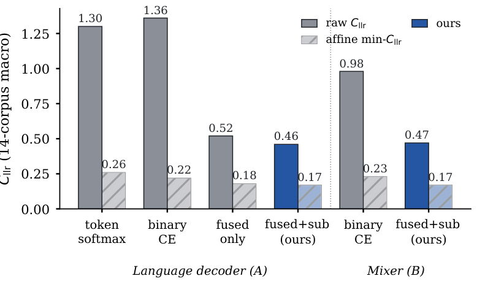

# SpoofLLM

[](LICENSE)
[](https://github.com/JunyiPeng00/SpoofLLM)

[**Model weights**](https://huggingface.co/JYP2024/SpoofLLM-detector)
| [**Detection inference**](inference/)
| [**Results**](#results)

SpoofLLM is a prompt-conditioned audio language model for speech anti-spoofing. One set of weights
scores an utterance for spoofing and writes out the spoofed time intervals as JSON, with the task
instruction selecting which.

Countermeasures are normally trained on the binary bona fide / spoof label, but a trained
countermeasure also emits a continuous score. SpoofLLM regresses those teacher scores alongside the
label. Across fourteen DF-Arena protocols this lowers macro equal error rate from 6.16 % to 4.89 %
and cuts calibration cost sharply. Replacing the language decoder with a randomly initialised
Transformer of matched size moves the numbers the same way, so the gain comes from the supervision
rather than from the language model.

### At a glance

Fourteen DF-Arena detection protocols, unweighted macro. Oracle affine cost is fitted and evaluated
on each protocol's own trials, so it is a diagnostic bound rather than a deployable calibration.

| System | Macro EER % ↓ | Raw *C*<sub>llr</sub> ↓ | Oracle affine ↓ |
|---|---|---|---|
| **SpoofLLM, fine-tuned encoder — released here** | **4.77** | **0.41** | 0.19 |
| SpoofLLM, frozen encoder | 4.89 | 0.46 | **0.17** |
| same model, binary cross-entropy instead of score supervision | 6.16 | 1.36 | 0.22 |
| DF-Arena-1B | 5.71 | 0.30 | 0.19 |
| HoliAntiSpoof, released checkpoint re-scored here | 13.47 | 1.81 | 0.41 |

On PartialSpoof the fine-tuned joint model reaches 92.36 % segment F1 on the 160 ms grid while still
doing utterance-level detection at 5.05 % EER.



---

## Quick start

```bash
git clone https://github.com/JunyiPeng00/SpoofLLM && cd SpoofLLM/inference
pip install torch torchaudio            # pick the build for your CUDA / ROCm
pip install -r requirements.txt
python download_weights.py --out models/          # checkpoint + the frozen Qwen base, ~7 GB

python score_wavs.py \
  --ckpt models/merge_a0.5_b0.5_ep3.pt \
  --llm models/Qwen2.5-1.5B-Instruct \
  --wavs my_files.txt --out scores.jsonl --device cuda
```

`--wavs` takes a file list or a directory. Any sample rate; files are mixed to mono and resampled to
16 kHz. The checkpoint carries the complete fine-tuned XLS-R-1B encoder, so no pretrained acoustic
model is downloaded and none of the teachers are needed at inference.

A two-file smoke test with reference outputs ships in `inference/smoke/`. Run it first.

### Reading the scores

Each line of `scores.jsonl` carries `spoof_score`: a log-odds on the teacher scale where **positive
means spoof**. This is the score behind every EER and *C*<sub>llr</sub> below. It is the head output
restored with the training-pool mean and standard deviation, with no post-hoc calibration.

Two things decide whether you get the reported behaviour:

- **Threshold.** Zero decides at equal priors, but the teacher scale keeps the calibration-set
  prior. A threshold picked on a small labelled development set from your own domain will do better.
  The raw-versus-oracle gap in the table above is exactly the cost a per-corpus affine map recovers.
- **Duration.** The model scores the leading 4.04 s and repeat-pads anything shorter, which is the
  protocol behind the reported numbers. For longer recordings, cut them into 4 s chunks and
  aggregate: mean if you expect the whole recording to be manipulated, max if only part of it.

`lr_S1`, `lr_S2`, `lr_S3` are the artifact, naturalness and residual component scores on the same
scale. `eer_from_scores.py` turns a scored file plus a label list into EER and *C*<sub>llr</sub>.
Full details in [`inference/README.md`](inference/README.md).

---

## Results

### Detection: fourteen DF-Arena protocols

Seen and unseen refer to SpoofLLM's own training coverage. External systems keep their original
training conditions. Bold marks the best value within each backend.

| System / supervision | 19LA | ASV5 | CFake | LSeVoc | DFADD | **Macro₅** | 21LA | 21DF | ITW | FoR | SONAR | A22T1 | A22T3 | A23R1 | A23R2 | **Macro₉** | **Macro₁₄ ↓** | Raw *C*<sub>llr</sub> ↓ | Oracle affine ↓ |
|---|---|---|---|---|---|---|---|---|---|---|---|---|---|---|---|---|---|---|---|
| *Language decoder (A)* |
| token softmax | 0.76 | 14.39 | 5.41 | 0.08 | **0.00** | 4.13 | 5.88 | 2.73 | 2.35 | 9.53 | 1.57 | 23.71 | 3.48 | 7.85 | 11.31 | 7.60 | 6.36 | 1.30 | 0.26 |
| binary cross-entropy | 1.01 | 15.80 | **4.98** | 0.08 | **0.00** | 4.37 | 7.31 | 3.10 | 1.32 | 7.95 | 1.54 | 23.66 | 3.05 | 6.66 | 9.83 | 7.16 | 6.16 | 1.36 | 0.22 |
| primary score only | 0.35 | 13.68 | 8.28 | 0.05 | **0.00** | 4.47 | 6.62 | 1.56 | 1.09 | **2.87** | 0.79 | 23.44 | 2.12 | 4.83 | 7.43 | 5.64 | 5.22 | 0.52 | 0.18 |
| primary + components | 0.26 | **12.82** | 7.18 | 0.11 | **0.00** | **4.07** | 5.08 | 0.96 | 0.93 | 3.80 | **0.57** | 21.94 | **2.08** | **4.65** | 8.03 | 5.34 | 4.89 | 0.46 | **0.17** |
| &nbsp;&nbsp;+ encoder fine-tuning **(released)** | **0.14** | 13.23 | 9.13 | **0.00** | **0.00** | 4.50 | **3.10** | **0.79** | **0.74** | 3.75 | 1.05 | **20.60** | 2.21 | 5.17 | **6.86** | **4.92** | **4.77** | **0.41** | 0.19 |
| *Mixer (B)* |
| binary cross-entropy | 1.05 | 16.05 | **4.96** | 0.09 | **0.00** | 4.43 | **4.43** | 3.34 | 1.54 | 9.58 | 1.63 | 24.85 | 3.64 | 6.27 | 10.76 | 7.34 | 6.30 | 0.98 | 0.23 |
| primary + components | **0.28** | **12.98** | 8.04 | **0.08** | **0.00** | **4.28** | 4.57 | **1.21** | **1.02** | **3.27** | **0.88** | **23.11** | **2.08** | **5.34** | **8.56** | **5.56** | **5.10** | **0.47** | **0.17** |
| *Teachers and external systems* |
| five-member fusion | 0.10 | 12.71 | 31.45 | 0.56 | 0.13 | 8.99 | 2.43 | 1.33 | 2.82 | 1.46 | 7.93 | 22.51 | 4.11 | 15.31 | 17.90 | 8.42 | 8.62 | 3.71 | 0.27 |
| DF-Arena-1B | 1.13 | 17.41 | 8.07 | 0.19 | 0.00 | 5.36 | 4.94 | 1.93 | 0.91 | 3.02 | 1.14 | 22.27 | 2.20 | 5.14 | 11.56 | 5.90 | 5.71 | 0.30 | 0.19 |
| HoliAntiSpoof, re-scored here | 1.09 | 24.85 | 15.27 | 1.13 | 24.90 | 13.45 | 10.28 | 8.17 | 0.81 | 1.55 | 20.06 | 26.88 | 8.85 | 24.57 | 20.17 | 13.48 | 13.47 | 1.81 | 0.41 |

Detection EER in %. Protocols: ASVspoof 2019 LA, ASVspoof 5 Track 1, CodecFake, LibriSeVoc, DFADD,
ASVspoof 2021 LA, ASVspoof 2021 DF, In-the-Wild, FoR, SONAR, ADD 2022 Track 1 and 3, ADD 2023
Round 1 and 2.

Both students land below DF-Arena-1B, which supplies their own primary targets on seven training
corpora. The frozen student beats it on ten of the fourteen protocols.

<p align="center"></p>

Axes are normalized independently per protocol. The best of the three systems lies on the rim and
the boxed value gives that system's EER in %.

### Calibration

<p align="center"></p>

Score supervision lowers the raw cost far more than the oracle affine cost, so most of what binary
training gives up is scale and offset that a per-corpus affine map could have recovered. The
raw-to-affine gap falls from 1.14 to 0.29 for the decoder and from 0.75 to 0.30 for the mixer.

Encoder fine-tuning is not free here: it buys the lowest EER and raw cost, but oracle affine cost
rises from 0.17 to 0.19. If you intend to fit your own calibration, the frozen-encoder system is the
better base.

### Training window and adapter

Data, seed and optimizer are held fixed. Evaluation always uses full-length audio; only the training
window varies.

| System | Training window | EER % ↓ | Raw *C*<sub>llr</sub> ↓ |
|---|---|---|---|
| *Language decoder (A)* |
| input up to 20 s | 20 s | 6.35 | 0.65 |
| **leading window** | **4.04 s** | **4.89** | **0.46** |
| &nbsp;&nbsp;final encoder layer only | 4.04 s | 6.11 | 0.60 |
| &nbsp;&nbsp;frame tokens only, no global tokens | 4.04 s | 5.38 | 0.53 |
| *Mixer (B)* |
| input up to 20 s | 20 s | 6.20 | 0.61 |
| random crop | 4.04 s random | 6.68 | 0.63 |
| **leading window** | **4.04 s** | **5.10** | **0.47** |

Cross-layer aggregation and global tokens both earn their place. A leading training window beats
both a longer window and an equal-duration random crop.

### Localization: PartialSpoof, 160 ms grid

Encoders are frozen unless stated. Single-task and joint comparisons match total optimizer updates,
so joint training gives localization about half the updates of its single-task counterpart. Segment
error is threshold-swept segEER for frame-based systems and balanced error at one operating point
for generated spans.

| Configuration | Det. EER % single | Det. EER % joint | Seg. error % single | Seg. error % joint | segF1 % joint | JSON % joint |
|---|---|---|---|---|---|---|
| *Language decoder (A), score-based readout* |
| frame head, text instruction | 4.89 | 5.28 | 7.65 | 7.81 | 91.18 | – |
| *Language decoder (A), generated spans (single operating point)* |
| span generation, text instruction | 4.89 | 5.13 | 9.11 | 11.56 | 88.15 | 99.48 |
| &nbsp;&nbsp;+ encoder fine-tuning | 4.77 | **5.05** | 10.20 | **6.37** | **92.36** | 99.49 |
| span generation, code₁ selector | 4.89 | 5.21 | 9.11 | 11.92 | 87.74 | 99.49 |
| *Mixer (B), task embedding, score-based readout* |
| frame head | 6.81 | 6.65 | 7.60 | 9.46 | 89.74 | – |

Single-task reference with a fine-tuned encoder on the same grid: CFPRF at 6.20 % segEER and
93.81 % segF1.

Joint training hurts localization with a frozen encoder and helps it with a fine-tuned one. About
99.5 % of generated outputs are valid JSON under a strict criterion: the text must parse as a list
of `{"s", "e"}` objects with finite two-decimal endpoints, positive duration, chronological and
non-overlapping, and must re-serialize byte-for-byte.

`CON_E_0000368`, PartialSpoof evaluation, 3.09 s:

```
reference   [{"s":0.32,"e":1.76},{"s":2.24,"e":2.88}]
prediction  [{"s":0.32,"e":1.76},{"s":2.24,"e":3.04}]
```

The first interval matches; the second ends one 0.16 s grid step late.

---

## Method

### Score supervision

Alongside the binary label, the student regresses a primary detection target and three auxiliary
component scores, all logistic-calibrated log-odds:

| Target | Source |
|---|---|
| primary | corpus-dependent: a five-member fusion for ASVspoof 2019 LA and PartialSpoof, DF-Arena-1B for seven corpora, a WavLM-HP expert for ASVspoof 5 |
| S₁, artifact | AASIST + RawNet2-DF, two countermeasures without SSL front ends |
| S₂, naturalness | UTMOS with pitch, duration, voicing, jitter and shimmer statistics |
| S₃, residual | DF-Arena-1B + XLS-R-AASIST, residualized against S₁ and S₂ and recalibrated |

Corpus identity selects the training-target source only. At inference the student restores the
primary prediction alone: no teacher, no corpus identity, no post-hoc calibrator.

The ladder in the detection table separates the two effects. Primary-score regression carries the
larger share, 6.16 → 5.22, and the three components add 5.22 → 4.89 when tested jointly.

### Dual-stream adapter

Detection needs utterance-level context; localization needs time-indexed features. The adapter
extends multi-head factorized attention pooling so that one set of attention weights and values
feeds both: temporal pooling yields eight global tokens, keeping time yields `T` frame tokens. Keys
and values each take their own learned mixture over all 49 XLS-R-1B hidden states, which is where
the cross-layer ablation above pays off.

Panel (c) of the figure is the control: a randomly initialized bidirectional Transformer mixer
replaces Qwen and LoRA, matched to within 1 % of its trainable backend parameters, 4.40 M against
4.36 M. It moves the same way under score supervision, 6.30 → 5.10.

### Training data

The detection pool holds 4.57 M utterances from ten corpora: SpoofCeleb, CodecFake, MLAAD, DFADD,
EnvSDD, PartialSpoof, ASVspoof 5, CtrSVDD, LibriSeVoc and ASVspoof 2019 LA. PartialSpoof also
supplies the official 160 ms segment labels behind both localization outputs. Teacher calibration is
fitted on ASVspoof 2019 LA development data: 24,844 utterances, 22,296 spoof and 2,548 bona fide.

---

## Citation

```bibtex
@article{peng2026spoofllm,
  title   = {{SpoofLLM}: A Prompt-Conditioned {LALM} for Spoof Detection and Localization},
  author  = {Peng, Junyi and Fan, Lichun and Zhang, Lin and Plchot, Old{\v{r}}ich and
             Stafylakis, Themos and Luan, Jian and {\v{C}}ernock{\'y}, Jan},
  year    = {2026},
  note    = {Under review}
}
```

## License

Apache License 2.0 for the code. The checkpoint is released for research use; see
[LICENSE](LICENSE).
